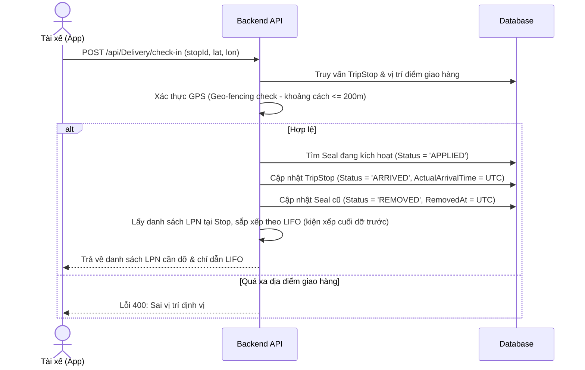
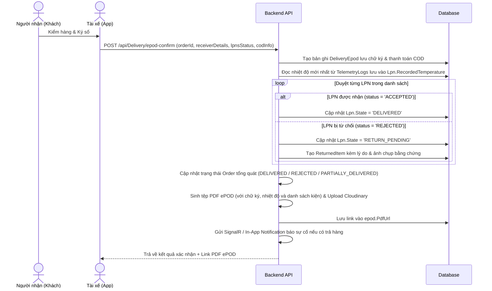
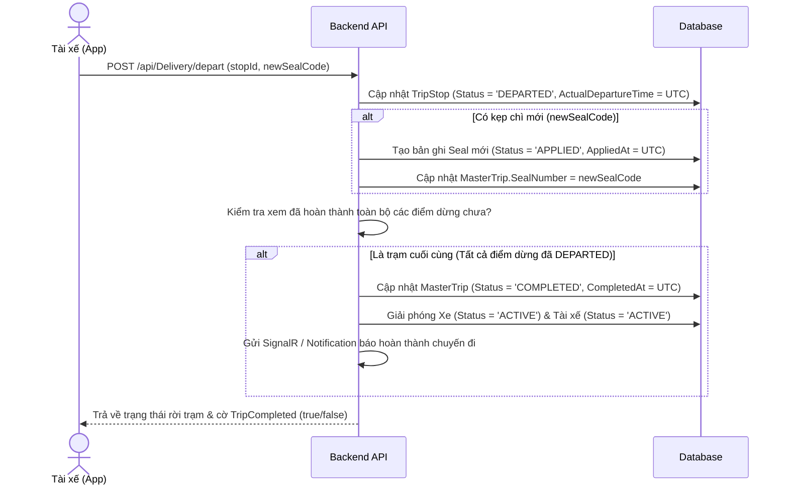

# Luồng Giao hàng Tận nơi & Thu hộ (Door Delivery & COD Flow)

Tài liệu thiết kế luồng nghiệp vụ giao hàng tận nơi, nghiệm thu điện tử ePOD, thu hộ tiền mặt/QR Code (COD) và kẹp chì chặng tiếp theo cho tài xế trên ứng dụng di động.

---

## 1. Kịch bản Luồng chi tiết (Detailed Sub-flows Scenario)

Quy trình giao hàng ghép chặng (Multi-stop delivery) diễn ra tuần tự tại từng điểm dừng trên lộ trình.

### Bước 1: Check-in & Cắt chì cũ (Check-in & Cut Seal)
Khi tài xế lái xe đến điểm dừng của khách hàng, tài xế thực hiện Check-in trên ứng dụng. Hệ thống tự động kiểm tra GPS, tự động cắt seal chì hiện tại và chỉ dẫn dỡ hàng theo nguyên lý LIFO.



### Bước 2 & 3: Nghiệm thu ePOD & Thu hộ COD (ePOD & COD Confirmation)
Người nhận thực hiện kiểm tra hàng hóa, ký số trực tiếp lên ứng dụng tài xế. Tài xế thực hiện thu tiền cước hoặc tiền thu hộ (COD) bằng tiền mặt hoặc mã QR và chốt trên hệ thống. 
* **Hỗ trợ Giao hàng một phần (Partial Delivery)**: Cho phép chốt nhận hoặc từ chối theo từng kiện LPN cụ thể thay vì bắt buộc toàn bộ đơn hàng.
* **Bằng chứng hình ảnh**: Nếu có kiện bị từ chối, yêu cầu chụp hình ảnh chứng cứ.
* **Kiểm tra nhiệt độ IoT**: Đọc nhiệt độ cảm biến mới nhất và lưu vào hệ thống để in biên bản giao nhận.



### Bước 4: Rời điểm dừng & Kẹp chì mới (Depart & Re-seal)
Tài xế đóng cửa thùng xe, kẹp một chiếc chì nhựa mới và cập nhật mã chì lên hệ thống trước khi di chuyển sang trạm giao tiếp theo.



---

## 2. Giải thích Nghiệp vụ Thực tế & Tính năng Nâng cao

### 2.1. Quy trình "Chạy chì chặng" (Re-sealing)
* **Ý nghĩa:** Khi xe đi giao hàng ghép qua nhiều trạm, mỗi trạm tài xế phải cắt seal cũ để lấy hàng của trạm đó ra. Hàng của các trạm sau vẫn nằm trong xe, do đó cần phải **kẹp chì mới** ngay lập tức để niêm phong lại thùng xe, đảm bảo hàng hóa của các khách hàng sau không bị cạy mở hay tráo đổi dọc đường.
* **Tính mềm dẻo:** Để phù hợp với các chuyến hàng thường (bảo mật thấp, không bắt buộc kẹp chì chặng), trường `newSealCode` trong API khởi hành sẽ là **tùy chọn (optional)**.

### 2.2. Phân định Chứng từ: Biên lai COD vs Hóa đơn vận chuyển (Logistics Invoice)
* **Tại điểm dừng giao hàng:** Tài xế không in hóa đơn đỏ (VAT). **PDF ePOD** đóng vai trò là **Biên lai/Phiếu thu** tạm thời xác nhận số tiền COD đã thu thành công kèm phương thức thanh toán.
* **Đối soát tại văn phòng:** Tiền COD thu được sẽ lưu vào database nhằm mục đích cho bộ phận kế toán thực hiện **Đối soát COD** với tài xế khi kết thúc chuyến đi.
* **Hóa đơn cước vận chuyển (Service Invoice):** Được quản lý tập trung ở module `Invoices` độc lập, dùng để tính phí dịch vụ logistics cho chủ hàng (Shipper) chứ không giao dịch trực tiếp với người nhận hàng.

### 2.3. Quy trình Lai (Hybrid Model) trong Nghiệm thu ePOD
* **Giao hàng thành công (`IsAccepted = true`):** Đơn hàng và kiện hàng (LPN) lập tức chuyển sang trạng thái `DELIVERED`. Biên bản giao nhận điện tử (e-POD PDF) được tự động sinh ra và chốt ngay mà không cần phê duyệt thêm để đảm bảo tốc độ vận hành thực tế.
* **Giao hàng thất bại / Khách từ chối (`IsAccepted = false`):** Đơn hàng chuyển sang `REJECTED`, LPN chuyển sang `RETURN_PENDING` (chờ trả về kho) và tạo bản ghi hàng trả lại `ReturnedItem` ở trạng thái `PENDING`. Khi xe quay về kho, thủ kho sẽ đối soát thực tế hàng lỗi và duyệt chốt trên hệ thống nhằm kiểm soát rủi ro tài xế tự ý báo từ chối ảo.

### 2.4. Bổ sung các Tính năng Hoàn thiện & Chỉnh chu
* **Xác thực GPS (Geo-fencing check)**: Kiểm tra vị trí của tài xế cách điểm dừng <= 200m để tránh trường hợp tài xế bấm Check-in ảo cách xa điểm giao hàng.
* **Kiểm tra nhiệt độ cảm biến IoT**: Đọc nhiệt độ sensor mới nhất từ `TelemetryLogs` của xe tải, lưu vào `Lpn.RecordedTemperature` và hiển thị trên PDF ePOD để người nhận ký xác nhận nhiệt độ bảo quản chuẩn.
* **Chụp ảnh bằng chứng hàng trả**: Nếu khách hàng từ chối nhận hàng, tài xế chụp ảnh hàng lỗi và đẩy lên hệ thống. Ảnh này được liên kết với `ClaimEvidence` và `Lpn` để phục vụ đối soát.
* **Giao hàng một phần (Partial Delivery)**: Cho phép chốt nhận hoặc từ chối theo từng LPN, cập nhật trạng thái đơn hàng tương ứng là `PARTIALLY_DELIVERED`.
* **Thông báo thời gian thực (SignalR)**: Tự động gửi thông báo đến nhóm Điều phối (`Group_Dispatcher`) và nhóm Thủ kho (`Group_WarehouseMonitor`) khi tài xế check-in, giao hàng thất bại hoặc hoàn thành chuyến đi.

### 2.5. Hai Kịch bản Tích hợp & Demo Thanh toán QR Code (COD QR)
Để phục vụ quá trình phát triển đồ án và demo chạy thử một cách linh hoạt, hệ thống thiết kế **một Endpoint Webhook duy nhất** (`POST /api/Payment/bank-webhook`) tương thích với cả 2 kịch bản:

* **Kịch bản 1 (Demo bán tự động qua Swagger/UI - Ưu tiên đơn giản):**
  * App sinh mã VietQR động chứa số tiền và nội dung chuyển khoản là mã đơn hàng (ví dụ: `CCX_ORDER_123`).
  * Người dùng quét mã và chuyển tiền thật.
  * Sau khi hoàn tất chuyển khoản, người trình bày demo bấm một nút **"Simulate Bank Response"** trên giao diện Web Admin (hoặc gọi Swagger API `bank-webhook` bằng tay) để gửi gói tin giả lập thanh toán thành công.
  * Hệ thống chốt thanh toán và báo xanh ngay lập tức thông qua SignalR.
  
* **Kịch bản 2 (Tự động 100% qua Ngrok + PayOS/SePay - Nâng cao):**
  * Tận dụng chính API `bank-webhook` ở trên.
  * Nhà phát triển mở cổng Localhost ra internet bằng **Ngrok** và cấu hình URL webhook này lên hệ thống PayOS hoặc SePay.
  * Khi khách hàng quét mã QR động và chuyển tiền thật (ví dụ: 2,000 VND), cổng thanh toán thật sẽ tự động gửi gói tin Webhook đến link Ngrok dẫn trực tiếp vào API localhost của dự án.
  * Hệ thống tự động xác nhận, chốt đơn và báo xanh mà không cần bất kỳ thao tác bấm nút giả lập nào.

---

## 3. Thiết kế Cấu trúc Dữ liệu & Database

### 3.1. Trạng thái vòng đời LPN (`LpnState` Enum)
Bổ sung trạng thái giao hàng thành công:
```csharp
public enum LpnState
{
    // ... các trạng thái cũ
    SHIPPING          = 8,
    DELETED           = 10,
    DELIVERED         = 11 // Trạng thái mới: Đã giao thành công
}
```

### 3.2. Cập nhật thực thể `DeliveryEpod`
Bổ sung các trường quản lý dòng tiền thu hộ (COD):
```csharp
public decimal? CodAmount { get; set; }        // Số tiền COD gốc cần thu (mặc định lấy từ CargoValue đơn hàng)
public decimal? CodAmountPaid { get; set; }    // Số tiền thực tế tài xế đã thu
public string? PaymentMethod { get; set; }     // Phương thức thanh toán (CASH / QR)
public string? PaymentStatus { get; set; }     // Trạng thái thanh toán (UNPAID / PAID / PARTIALLY_PAID)
public string? PaymentEvidenceImageUrl { get; set; } // Ảnh chụp biên lai chuyển khoản thành công của khách
```

### 3.3. Ánh xạ EF Core (`ApplicationDbContext.cs`)
Cấu hình Fluent API trong `OnModelCreating`:
```csharp
entity.Property(e => e.CodAmount)
    .HasPrecision(15, 2)
    .HasColumnName("cod_amount");
entity.Property(e => e.CodAmountPaid)
    .HasPrecision(15, 2)
    .HasColumnName("cod_amount_paid");
entity.Property(e => e.PaymentMethod)
    .HasMaxLength(20)
    .HasColumnName("payment_method");
entity.Property(e => e.PaymentStatus)
    .HasMaxLength(20)
    .HasColumnName("payment_status");
entity.Property(e => e.PaymentEvidenceImageUrl)
    .HasMaxLength(255)
    .HasColumnName("payment_evidence_image_url");
```

---

## 4. Thiết kế Chi tiết các API Endpoints

### 4.1. API Check-in: `POST /api/Delivery/check-in`
* **Request:**
  ```json
  {
    "stopId": "00000000-0000-0000-0000-000000000000",
    "latitude": 10.762622,
    "longitude": 106.660172
  }
  ```
* **Logic:**
  1. Lấy thông tin `TripStop` và vị trí địa lý của địa điểm giao hàng (`Location`).
  2. Tính khoảng cách địa lý (Haversine formula). Nếu khoảng cách > 200m -> Trả về lỗi 400: *"Bạn đang ở quá xa địa điểm giao hàng."*
  3. Cập nhật `TripStop.Status = "ARRIVED"` và `TripStop.ActualArrivalTime = DateTime.UtcNow`.
  4. Tìm kiếm Seal đang hoạt động trên chuyến xe (`Status == "APPLIED"`), cập nhật thành `"REMOVED"` và ghi nhận thời gian cắt chì (`RemovedAt = DateTime.UtcNow`).
  5. Lấy danh sách LPN của điểm dừng giao hàng hiện tại (dựa trên địa chỉ Destination), sắp xếp dỡ hàng theo thứ tự LIFO (kiện bốc lên xe sau cùng thì dỡ trước).
  6. Gửi SignalR thông báo xe đã đến trạm.
* **Response (Success 200):**
  ```json
  {
    "success": true,
    "message": "Check-in thành công. Đã ghi nhận cắt chì niêm phong cũ.",
    "data": {
      "stopId": "guid",
      "checkinTime": "2026-06-24T20:50:00Z",
      "removedSealCode": "SEAL-12345",
      "lpnsToUnload": [
        {
          "lpnId": "guid",
          "lpnCode": "LPN0001",
          "itemName": "Sữa đông lạnh",
          "quantity": 100,
          "unloadOrder": 1,
          "tempCondition": "FROZEN"
        }
      ]
    }
  }
  ```

### 4.2. API Nghiệm thu & Thu hộ: `POST /api/Delivery/epod-confirm`
* **Request:**
  ```json
  {
    "orderId": "guid",
    "receiverName": "Nguyễn Văn A",
    "receiverPhone": "0901234567",
    "signImageUrl": "data:image/png;base64,...",
    "signLatitude": 10.762622,
    "signLongitude": 106.660172,
    "deliveryRating": 5,
    "note": "Hàng đầy đủ chất lượng tốt",
    "codAmountPaid": 1250000.0,
    "paymentMethod": "QR", // CASH hoặc QR
    "paymentEvidenceImageUrl": "https://cloudinary/.../receipt_payment.jpg", // Ảnh chụp biên lai của khách
    "lpns": [
      {
        "lpnId": "guid1",
        "isAccepted": true
      },
      {
        "lpnId": "guid2",
        "isAccepted": false,
        "rejectionReason": "RA_DONG", // MOP_MEO, RA_DONG, KHAC
        "rejectionNotes": "Đá gel bị chảy nước",
        "evidenceImageUrl": "https://cloudinary/.../evidence1.jpg" // Ảnh bằng chứng hàng lỗi
      }
    ]
  }
  ```
* **Logic:**
  1. Tạo bản ghi `DeliveryEpod` mới lưu thông tin nghiệm thu, chữ ký và thanh toán COD.
  2. Đọc nhiệt độ cảm biến mới nhất từ `TelemetryLogs` của xe thuộc chuyến này, gán vào `Lpn.RecordedTemperature` cho toàn bộ LPN được giao.
  3. Duyệt danh sách `lpns` gửi lên:
     * **Nếu LPN được nhận (`isAccepted == true`):**
       * Cập nhật `Lpn.State = LpnState.DELIVERED`.
     * **Nếu LPN bị từ chối (`isAccepted == false`):**
       * Cập nhật `Lpn.State = LpnState.RETURN_PENDING`.
       * Gán `Lpn.DiscrepancyReason = rejectionReason`.
       * Gán `Lpn.EvidenceImageUrl = evidenceImageUrl`.
       * Tạo bản ghi `ReturnedItem` lưu chi tiết hư hỏng.
  4. Cập nhật trạng thái chung cho `TransportOrder`:
     * Nếu nhận hết -> `DELIVERED`.
     * Nếu từ chối hết -> `REJECTED`.
     * Nếu nhận một phần -> `PARTIALLY_DELIVERED`.
  5. Lấy dữ liệu, biên dịch qua template [Epod.html](file:///c:/Users/tranl/OneDrive/Desktop/6-11-2026/ColdChainX/ColdChainX.Infrastructure/Templates/Epod.html) bằng Puppeteer để sinh file PDF ePOD và upload lên Cloudinary. Cập nhật `epod.PdfUrl`.
  6. Gửi SignalR thông báo tình trạng giao nhận. Gửi thông báo In-App đặc biệt đến điều phối viên nếu có hàng trả lại.
* **Response (Success 200):**
  ```json
  {
    "success": true,
    "message": "Nghiệm thu ePOD và chốt COD thành công.",
    "data": {
      "epodId": "guid",
      "orderStatus": "PARTIALLY_DELIVERED",
      "paymentStatus": "PAID",
      "pdfUrl": "https://res.cloudinary.com/.../epod_xxx.pdf"
    }
  }
  ```

### 4.3. API Khởi hành chặng mới: `POST /api/Delivery/depart`
* **Request:**
  ```json
  {
    "stopId": "guid",
    "newSealCode": "SEAL-99999" // Tùy chọn (optional)
  }
  ```
* **Logic:**
  1. Cập nhật `TripStop.Status = "DEPARTED"` và `TripStop.ActualDepartureTime = DateTime.UtcNow`.
  2. Nếu có `newSealCode`, tạo bản ghi `Seal` mới với trạng thái `"APPLIED"`, cập nhật `MasterTrip.SealNumber = newSealCode`.
  3. Kiểm tra xem toàn bộ các điểm dừng trong chuyến đi đã hoàn thành chưa (kiểm tra toàn bộ `TripStops` của `TripId` đã có `ActualDepartureTime`).
     * Nếu đã hoàn thành điểm dừng cuối: 
       * Cập nhật `MasterTrip.Status = "COMPLETED"`, `MasterTrip.CompletedAt = DateTime.UtcNow`.
       * Giải phóng Xe và Tài xế về trạng thái sẵn sàng: `Vehicle.Status = "ACTIVE"`, `Driver.Status = "ACTIVE"`.
       * Gửi SignalR thông báo hoàn thành chuyến đi.
* **Response (Success 200):**
  ```json
  {
    "success": true,
    "message": "Rời trạm thành công. Đã cập nhật seal mới.",
    "data": {
      "stopId": "guid",
      "departTime": "2026-06-24T21:10:00Z",
      "newSealCode": "SEAL-99999",
      "tripCompleted": false
    }
  }
  ```

### 4.4. API Webhook Nhận Thông Báo Thanh Toán: `POST /api/Payment/bank-webhook`
* **Mô tả:** Nhận tín hiệu thanh toán chuyển khoản QR thành công từ hệ thống thực tế (PayOS/SePay qua Ngrok) hoặc từ Nút giả lập trên Swagger UI/Web Admin.
* **Request:**
  ```json
  {
    "orderCode": "OUT_20260624", // Mã đơn hàng trùng với addInfo của VietQR
    "amount": 500000.0,
    "transactionId": "FT202606249999",
    "status": "PAID"
  }
  ```
* **Logic:**
  1. Tìm đơn hàng `TransportOrder` dựa trên `orderCode` (hoặc `TrackingCode`).
  2. Tìm bản ghi `DeliveryEpod` của đơn hàng này.
  3. Cập nhật `epod.CodAmountPaid = amount`, `epod.PaymentStatus = "PAID"`, `epod.PaymentMethod = "QR"`.
  4. Gửi tín hiệu thông báo real-time qua SignalR (`PickingStarted` hoặc event mới `PaymentCompleted`) tới giao diện tài xế để tự động chuyển tiếp màn hình xác nhận.
* **Response (Success 200):**
  ```json
  {
    "success": true,
    "message": "Giao dịch thanh toán được ghi nhận thành công."
  }
  ```

### 4.5. API Quyết toán COD của Tài xế: `POST /api/Delivery/trip/{tripId}/cod-handover`
* **Mô tả:** Thủ quỹ/Kế toán đối soát trực tiếp tiền mặt và các biên lai chuyển khoản tài xế nộp về cuối ngày để hoàn tất quyết toán chuyến đi.
* **Request:**
  ```json
  {
    "actualCashReceived": 3000000.0, // Số tiền mặt thực tế nhận từ tài xế
    "actualQrReceived": 2500000.0,   // Số tiền QR thực tế đã đối chiếu sao kê ngân hàng
    "note": "Đủ tiền mặt, khớp sao kê chuyển khoản"
  }
  ```
* **Logic:**
  1. Tính tổng tiền mặt thu hộ lý thuyết trên hệ thống của chuyến xe: `Sum(epod.CodAmountPaid)` với `epod.PaymentMethod == "CASH"`.
  2. Tính tổng tiền QR thu hộ lý thuyết trên hệ thống của chuyến xe: `Sum(epod.CodAmountPaid)` với `epod.PaymentMethod == "QR"`.
  3. So sánh chênh lệch giữa thực tế nộp và lý thuyết. Nếu có chênh lệch, cập nhật cảnh báo vào `note` và ghi nhận để hậu kiểm.
  4. Cập nhật toàn bộ `DeliveryEpod` của chuyến xe này có `PaymentStatus` sang trạng thái quyết toán hoàn tất.
* **Response (Success 200):**
  ```json
  {
    "success": true,
    "message": "Quyết toán chuyến đi thành công.",
    "data": {
      "expectedCash": 3000000.0,
      "actualCash": 3000000.0,
      "expectedQr": 2500000.0,
      "actualQr": 2500000.0,
      "cashDiscrepancy": 0.0,
      "qrDiscrepancy": 0.0,
      "status": "COD_SETTLED"
    }
  }
  ```

---

## 5. Kế hoạch Kiểm thử & Xác minh (Verification Plan)

### Kiểm thử Tự động (Unit Tests)
* Tạo dữ liệu giả lập chuyến đi gồm 3 điểm dừng.
* Thực hiện gửi Check-in tại điểm dừng 1: Xác nhận lỗi 400 khi toạ độ GPS quá xa, và check-in thành công khi đúng toạ độ, chì niêm phong ban đầu chuyển sang trạng thái đã cắt (`REMOVED`), danh sách LPN trả về khớp với thiết kế LIFO.
* Gọi webhook thanh toán QR giả lập: Xác nhận trạng thái e-POD chuyển sang `PAID` và nhận được tín hiệu SignalR.
* Giao hàng thành công tại điểm dừng 1: Xác nhận trạng thái đơn hàng và các LPN chuyển sang `DELIVERED`, đọc nhiệt độ sensor IoT chuẩn, sinh tệp PDF ePOD có chữ ký.
* Rời điểm dừng 1 và kẹp chì mới: Xác nhận mã chì mới được kích hoạt trên chuyến xe.
* Giao hàng một phần tại điểm dừng 2: Xác nhận LPN 1 chuyển sang `DELIVERED`, LPN 2 chuyển sang `RETURN_PENDING`, ảnh chụp bằng chứng được lưu, bản ghi `ReturnedItem` được tạo chính xác, đơn hàng chuyển thành `PARTIALLY_DELIVERED`.
* Hoàn thành điểm dừng 3 (cuối cùng): Xác nhận chuyến xe chuyển sang `COMPLETED`, trạng thái Xe và Tài xế được reset về `ACTIVE`.
* Quyết toán COD: Gọi API đối soát COD cuối ngày để xác nhận hoàn tất ca trực và khớp số liệu doanh thu.

### Xác minh Thủ công
* Chạy API cục bộ, dùng Postman gửi các chuỗi request tuần tự từ check-in -> epod-confirm -> depart cho từng trạm giao hàng.
* Truy vấn trực tiếp database PostgreSQL cục bộ để xác nhận sự biến đổi dữ liệu của các bảng `trip_stops`, `delivery_epods`, `returned_items`, `seals`, `lpns`, `transport_orders` và `master_trips`.
* Mở tệp PDF ePOD được upload trên Cloudinary để kiểm tra giao diện hiển thị thông tin ký nhận, nhiệt độ IoT và thu hộ COD.
